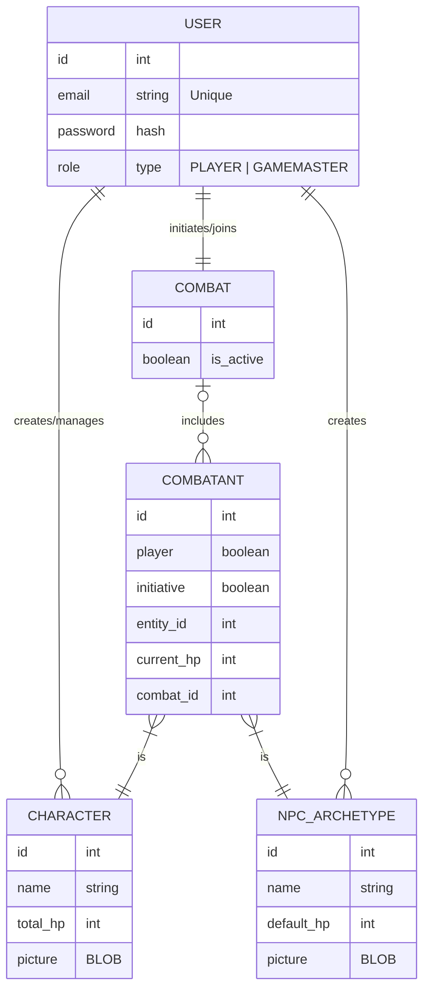

## Database

### Needs:

- Allow Users to be either a PLAYER or a GAMEMASTER
- Allow the PLAYER to create and manage its own CHARACTER which includes a picture and a HP system.
- The GM can create MONSTERS archetype.
- The GM can create NPC
- The GM can initiate a COMBAT which opens a session for the PLAYER tp join in with their character
- The GM can decide which monster achetype will be part of the combat
- All the PLAYER needs to input their initiative for a COMBAT. The monster initiative is automatically rolled
- A COMBAT state must be saved in case a session finished before a COMBAT resume
- We might not save each interaction within the app, so for now, Players and GM needs to be able to manage the HP of each of their characters at anytime during the combat session
- The GM needs to be able to add monster mid combat and chose wether or not he wants to manually input the new monster initiative

